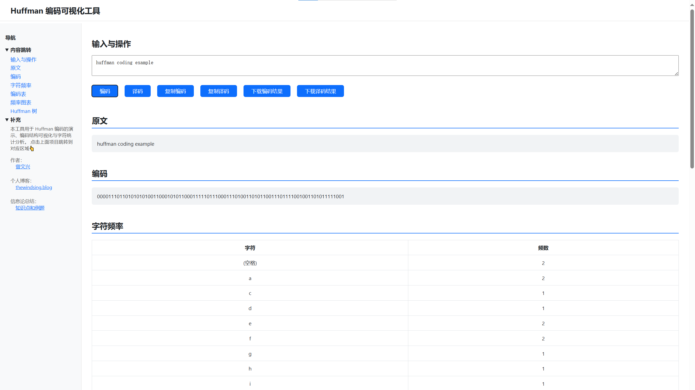
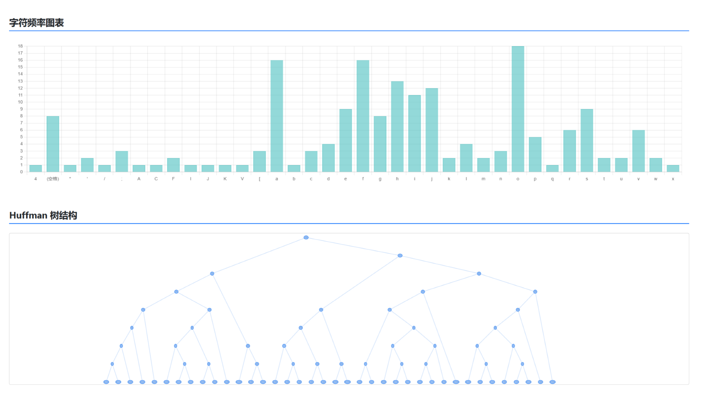

# 🔤 Huffman 编码可视化工具

一个基于 Python + Flask 的轻量级 Huffman 编码演示系统，支持编码、译码、频率统计图、编码表展示、树结构可视化、导出等功能。适合教学演示、算法理解和桌面工具打包。

---

## 📦 功能特色

- ✍️ 输入任意文本，生成 Huffman 编码
- 📋 支持编码效率统计、编码表展示、字符频率表与图形化柱状图
- 🌳 可视化展示 Huffman 树结构
- 🔁 支持手动译码
- 📤 编码结果支持复制 / 下载
- 🌐 一键浏览器启动（打包后 `launcher.exe` 即可运行）

---

## 🖼️ 页面预览

| 编码操作界面                            | 树结构可视化                          |
| --------------------------------------- | ------------------------------------- |
|  |  |

---

## 🧩 使用方式

### ✅ 方法 1： 使用app.py预览

```bash
# 安装依赖
pip install flask

# 启动服务
python app.py

# 浏览器访问
http://127.0.0.1:5000/
```

### ✅ 方法 2：使用 launcher 启动器

```bash
python launcher.py
```

---

## 🛠️ 打包为桌面应用

项目支持打包为 `.exe` 应用：

```bash
pyinstaller launcher.spec 
```

打包成功后可在 `dist/launcher/` 中获得 `launcher.exe`，双击即可运行。

---

## 📁 项目结构

```
huffman/
├── app.py              # Huffman 算法 + Flask 后端
├── launcher.py         # 启动器脚本
├── launcher.spec       # 打包配置文件
├── templates/
│   └── index.html      # 主页面 HTML 模板
├──  huffman_icon.ico   # 应用图标
├── docs/
│   └── 截图或文档
└── README.md           # 项目说明
```

---

## 📚 Huffman 编码简介

Huffman 编码是一种基于字符出现频率构造前缀树的无损压缩算法。本项目通过图形化的方式展示编码、树结构和频率分析，帮助更好理解其工作原理。

---

## ✅ 环境依赖

- Python 3.8 或以上
- Flask
- 浏览器支持：
  - CDN 加载 Chart.js、vis-network（无需本地安装）

可选依赖（如打包）：

```bash
pip install pyinstaller
```

---

## 🤝 许可协议

本项目遵循 [MIT License](LICENSE)，欢迎用于学习、教学、改进或二次开发。

---

## 📬 联系作者

如有建议、反馈或合作，欢迎联系作者。

- GitHub: [@thewindsing](https://github.com/thewindsing)
- Email: thewindsing@stud.tjut.edu.cn
- Blog: [thewindsing.blog](https://thewindsing.blog)